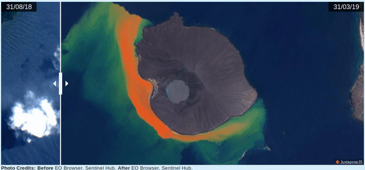

# Krakatau-JuxtaposeJS
Una pequeña aplicación web que muestra el antes y después de la morfología del volcán Anak Krakatau. Realicé una composición de imagenes en el espectro de la luz visible (bandas 4, 3, 2) con imagenes satélitales Sentinel 2, para una diferencia de tiempo de 7 meses. Para utilizar la aplicación Juxtapose, visite el siguiente enlace: https://juxtapose.knightlab.com/

## Visualización de la aplicación

Para usar la aplicación, da click en el siguiente enlace: https://adchp.github.io/Krakatau/
